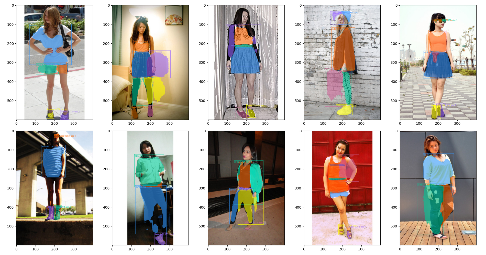

# Mask-R-CNN
Mask R-CNN for Image Segmentation over ModaNet Dataset. The Mask R-CNN used is the [PyTorch](https://pytorch.org/vision/main/models/mask_rcnn.html) model based on the [Mask R-CNN](https://arxiv.org/abs/1703.06870) paper.

[ModaNet](https://github.com/eBay/modanet) is a street fashion images dataset consisting of annotations related to RGB images. ModaNet provides multiple polygon annotations for each image. To realize this project the first version of the dataset is used, this version contains some mistakes regarding the annotations file, for example, some images are not associated with any annotation, some images are even corrupted, to handle those issues the _clean_dataset_ function has been implemented (you can find it in utils/utils.py).

The project goal is then to train/finetune the model to produce Image Segmentation over ModaNet dataset. The Segmentation will be applied over the dress categories which you can find in the modanet page linked before. 
## Run Locally
Show predictions over some **Test** images :
```bash
python .\main.py --mode test --use_accessory --resume --resume_name final_model
```
**Train** a new model using Accessory from scratch, the model will be saved as _model_name_ :
```bash
python .\main.py --mode train --use_accessory --model_name new_training
```
**Finetune** a model using Accessory :  
```bash
python .\main.py --mode train --use_accessory --pretrained --model_name new_finetuning  
```
If you really want to remove the Accessory Prediction Head, and not use the Accessory class then
 remove the --_use_accessory_ argument.

If you want to keep training a model you stopped earlier, then add the --_resume_ argument and
 specify the name of the model to resume (must be inside the checkpoint folder) with --_resume_name_
followed by the model file name :
```bash
--resume --resume_name my_model_name
```

If you want to use a model (for testing or resume training) from a folder that isn't the
 checkpoint folder then specify it by adding --_saving_path_ argument followed by the folder path
```bash
--saving_path my_checkpoint_path  
```
Finally you can customize the training or the fine-tuning of your model by using the following arguments (indipendently):
```bash
--lr 0.005 --opt ['SGD','Adam'] --epochs 16 --batch_size 16 --version ['V1','V2'] --use_amp 
``` 
Notes regarding the last bash -> keep in mind that the optimizer can be either SGD or Adam, if you finetune a model that has been trained on the V1 version of the PyTorch Mask R-CNN and you specify that the --_version_ is V2 then it won't work, and viceversa. Finally --_use_amp_ can be used only if you have CUDA activated on your GPU to use Automatic Mixed Precision to speed up the weights computation.

## Test Output
In this section are shown the results of three consecutive runs on the test set, which shows each time the mask, bounding box and accessory (if active) predictions over 10 different images. Of course as you can see sometime the mask predictor tend to output some false positives, but generally speaking it gives back a good approximation of the clothing's shapes.





## Environment Variables

To run this project, you will need to install the following packages to your environment

`pycocotools`
`pillow`
`torch`
`torchvision`
`torchmetrics`
`tensorboard`
`opencv-python`
`numpy`
`tqdm`
`matplotlib`
`json`

> [!NOTE]
> If you have any questions about the project contact me on LinkedIn following [this](https://www.linkedin.com/in/lorenzo-cipelli-3b1665230/) link 